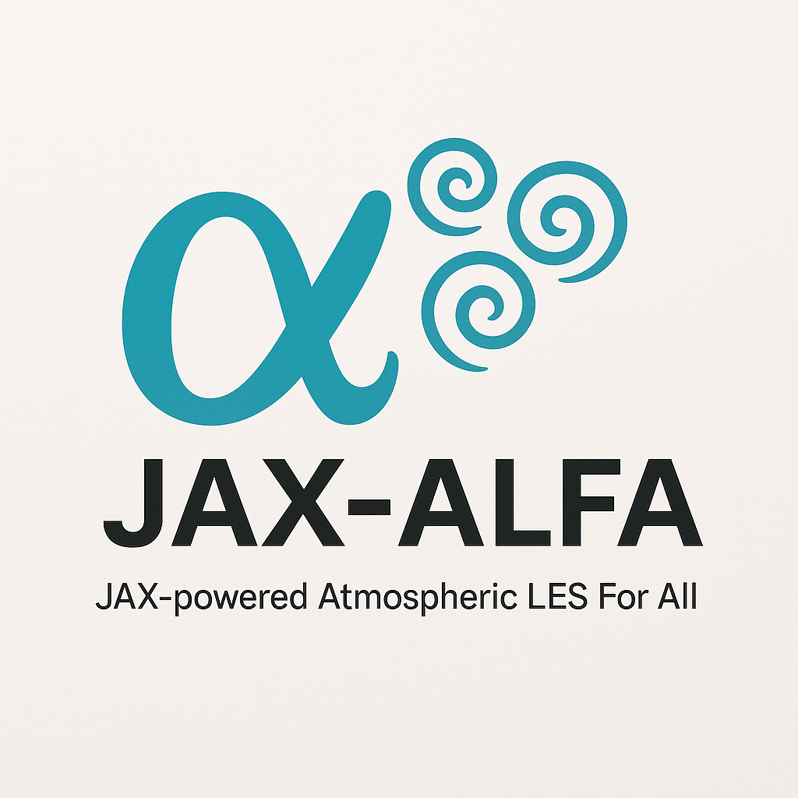

JAX-ALFA: JAX-powered **A**tmospheric **L**ES **F**or **A**ll

JAX-ALFA is a JAX-based large-eddy simulation (LES) framework for
atmospheric boundary-layer flows. It solves incompressible flow problems
using spectral methods for horizontal derivatives, finite differences in
the vertical direction, an FFT-based pressure solver, and subgrid-scale
closures including dynamic SGS coefficient computation.

The code is designed around JAX so that the same source can run on CPUs
and GPUs, with support for single- or double-precision computations. The
project is under active development, so interfaces, examples, and
documentation may continue to evolve.

Documentation:

https://jax-alfa.readthedocs.io/index.html

If you use JAX-ALFA in research, teaching, or derivative software, please
cite or acknowledge the GitHub repository and documentation. A formal
citation or DOI will be added when available.

License: GPL-3.0-or-later.
