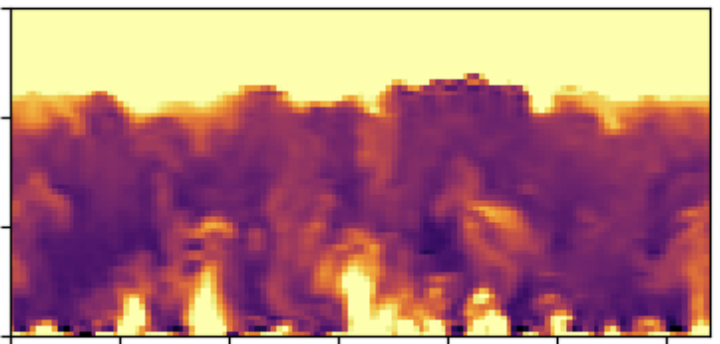

JAX-ALFA: JAX-powered Atmospheric LES For All
=============================================

Overview
--------

JAX-ALFA is a JAX-based large-eddy simulation framework for atmospheric
boundary layer simulations. It leverages JAX's CPU/GPU/TPU acceleration
capabilities to provide highly efficient cross-platform simulations
without any code changes.

Features
--------

- Incompressible flow solver
- Spectral methods for horizontal derivatives
- Finite difference methods for vertical derivatives
- FFT-based direct Poisson solver
- Dynamic SGS coefficient computation
- Prognostic potential temperature and specific humidity scalars
- Virtual potential temperature buoyancy coupling
- JAX-accelerated computations for CPUs & GPUs
- Either single or double precision computations

Download
--------
The JAX-ALFA package can be downloaded from:
https://github.com/Sukantabasu/jax-alfa

Requirements
------------

- Python 3.8+
- JAX
- NumPy

.. toctree::
   :maxdepth: 2
   :caption: Getting Started

   modules/Introduction
   modules/Installation
   modules/License

.. toctree::
   :maxdepth: 1
   :caption: Tutorial

   Stable BL: GABLS1 <tutorial/Tutorial_notebook>

.. toctree::
   :maxdepth: 1
   :caption: Performance Benchmarks

   A100 (80 GB) <benchmark/Benchmark_A100>
   Hardware Platform Comparison <benchmark/Benchmark_PlatformComparison>

.. toctree::
   :maxdepth: 2
   :caption: Case Studies

   examples/CBL_N91/index
   examples/NBL_A94/index
   examples/SBL_GABLS1/index
   examples/SBL_GABLS3/index
   examples/DC_Wangara/index

.. toctree::
   :maxdepth: 1
   :caption: Model Structure

   modules/ModelStructure

.. toctree::
   :maxdepth: 2
   :caption: Additional Resources

   modules/modules

Ask a Question
==============

Have a question or found a bug? Please open an issue on GitHub:
https://github.com/Sukantabasu/jax-alfa/issues

Indices and tables
==================

* :ref:`genindex`
* :ref:`modindex`
* :ref:`search`
