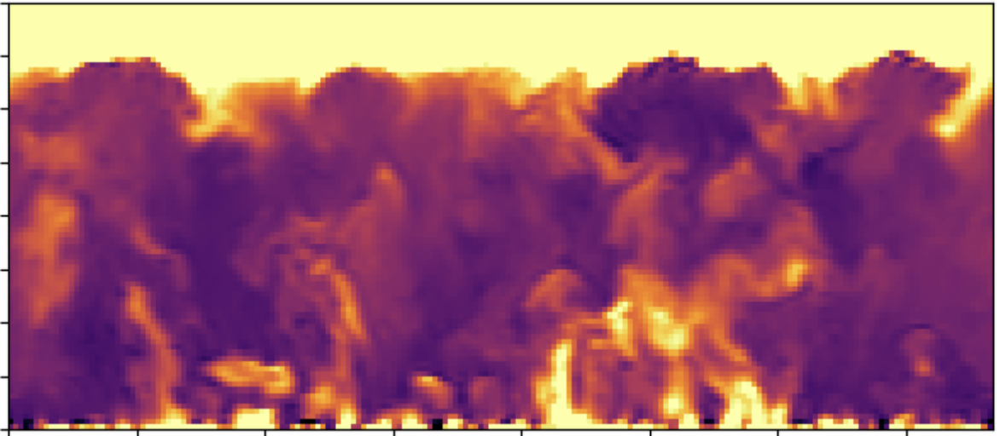

JAX-ALFA: JAX-powered Atmospheric LES For All
=============================================

Overview
--------

JAX-ALFA is a JAX-based large-eddy simulation framework for atmospheric
boundary layer simulations. It leverages JAX's CPU/GPU/TPU acceleration
capabilities to provide highly efficient cross-platform simulations
without any code changes.

Features
--------

- JAX-accelerated computations for CPUs & GPUs
- Spectral methods for horizontal derivatives
- Finite difference methods for vertical derivatives
- Dynamic SGS coefficient computation

Download
--------
The JAX-ALFA package can be downloaded from:
https://github.com/Sukantabasu/jax-alfa

Requirements
------------

- Python 3.8+
- JAX
- NumPy

.. toctree::
   :maxdepth: 1
   :caption: Change Log

   modules/Log

.. toctree::
   :maxdepth: 2
   :caption: Getting Started

   modules/Introduction
   modules/Installation
   modules/License

.. toctree::
   :maxdepth: 1
   :caption: Tutorial

   tutorial/Tutorial_notebook

.. toctree::
   :maxdepth: 1
   :caption: Benchmark

   benchmark/Benchmark_notebook

.. toctree::
   :maxdepth: 2
   :caption: Case Studies

   examples/CBL_N91/index
   examples/NBL_A94/index
   examples/SBL_GABLS1/index
   examples/SBL_GABLS3/index
   examples/SBL_GABLS4/index
   examples/ET_NB86/index
   examples/DC_WANGARA/index

.. toctree::
   :maxdepth: 1
   :caption: Initialization Modules (INI)

   modules/Config
   modules/Imports
   modules/Initialization
   modules/Preprocess
   modules/Utilities

.. toctree::
   :maxdepth: 1
   :caption: Main Program

   modules/Main

.. toctree::
   :maxdepth: 1
   :caption: Navier-Stokes Equations (NSE)

   modules/NSE_AllTerms
   modules/NSE_AdvectionTerms
   modules/NSE_BuoyancyTerms
   modules/NSE_PressureTerms
   modules/NSE_SGSTerms

.. toctree::
   :maxdepth: 1
   :caption: Subgrid-Scale Modeling (SGS)

   modules/StrainRates
   modules/SGSStresses
   modules/ScalarSGSFluxes
   modules/StaticSGS_Main
   modules/DynamicSGS_Main
   modules/DynamicSGS_LASDD
   modules/DynamicSGS_ScalarLASDD

.. toctree::
   :maxdepth: 1
   :caption: Core Operations (OPS)

   modules/FFT
   modules/Filtering
   modules/Derivatives
   modules/Dealiasing

.. toctree::
   :maxdepth: 2
   :caption: Additional Resources

   modules/modules

Indices and tables
==================

* :ref:`genindex`
* :ref:`modindex`
* :ref:`search`
